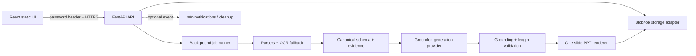

# Architecture

The pilot uses an in-process runner and local storage. Both are narrow seams: replace them with Redis/Container Apps Jobs and Blob/PostgreSQL without moving core business logic. n8n does not own parsing or generation.

