# Target Mode: Agentic Reference Intelligence and Knowledge Integration

## Mission

Evolve EraX Reference Agent from a single-reference extraction application into an auditable, multi-stage reference-intelligence workflow. The system must aggregate heterogeneous project evidence, normalize multilingual content, reuse approved organizational knowledge, create a high-quality one-page reference, and publish an interoperable JSON-LD knowledge bundle without inventing facts.

This target mode supplements `docs/TARGET_MODE.md`. Existing security, evidence-grounding, one-slide rendering, and human-review requirements remain mandatory.

## Operating decisions

- Use a code-owned state machine for orchestration. Agent decisions are explicit, typed, versioned, replayable, and observable.
- Use n8n only for source connectors, notifications, approval reminders, callbacks, and retention jobs. Do not place grounding, validation, or rendering logic in n8n.
- Keep raw client material and derived knowledge in Azure, not in the public application repository.
- Keep schemas, prompts, evaluation fixtures, infrastructure-as-code, and sanitized examples in GitHub.
- Use JSON-LD as the canonical interchange representation. Markdown is an optional human-readable projection of the same records.
- Use Azure Blob Storage as the source of record and Azure AI Search as the initial hybrid keyword/vector retrieval layer.
- Treat a separate graph database as Phase 2. Add it only for demonstrated traversal use cases that cannot be served by JSON-LD relations plus Azure AI Search filters.
- Require human approval before a generated reference or knowledge bundle becomes reusable across projects.

## Target architecture

```mermaid
flowchart LR
    UI["EraX frontend"] --> API["FastAPI orchestration API"]
    API --> RAW["Azure Blob: immutable source material"]
    API --> ORCH["Versioned workflow state machine"]
    ORCH --> EXTRACT["Deterministic extraction"]
    EXTRACT --> CURATOR["Evidence curator agent"]
    CURATOR --> LINKER["Entity and metric linker agent"]
    LINKER --> SEARCH["Azure AI Search"]
    SEARCH --> RETRIEVE["Retrieval planner agent"]
    RETRIEVE --> AGG["Claim aggregation agent"]
    AGG --> WRITER["Reference writer agent"]
    WRITER --> VERIFY["Grounding verifier agent"]
    VERIFY --> REVIEW["Human review gate"]
    REVIEW --> RENDER["Deterministic PPT renderer"]
    REVIEW --> PUBLISH["Knowledge publisher"]
    PUBLISH --> KNOWLEDGE["Azure Blob: approved JSON-LD bundles"]
    PUBLISH --> SEARCH
    PUBLISH -. optional .-> GRAPH["Property graph store"]
    ORCH -. events only .-> N8N["n8n connectors and notifications"]
```



## Azure persistence model

Provision these resources in the future dedicated resource group:

1. Storage account with private containers:
   - `raw-sources`: immutable uploaded originals, hash-addressed and retention-controlled.
   - `evidence`: normalized evidence units and extraction artifacts.
   - `knowledge`: approved project JSON-LD bundles and optional Markdown projections.
   - `outputs`: generated PowerPoint files and audit packages.
   - `quarantine`: rejected or unsupported files.
2. Azure AI Search:
   - `erax-evidence-v1`: fine-grained evidence units for within-project grounding.
   - `erax-references-v1`: approved claims, metrics, entities, and completed references for cross-project reuse.
   - Hybrid keyword/vector search, semantic ranking, classification filters, project/entity filters, and source citations.
3. Durable workflow state:
   - PostgreSQL, Azure SQL, or Cosmos DB for jobs, approvals, prompt/model versions, retries, and audit events.
4. Key Vault:
   - AI Gateway credential, Search credentials where managed identity is unavailable, and connector secrets.
5. Optional property graph:
   - Cosmos DB for Apache Gremlin or another approved graph platform when graph traversal becomes a requirement.

Use managed identity and role-based access wherever permissions permit. Never put model or storage secrets in the frontend.

## Canonical JSON-LD model

Use stable URNs and the following core node types:

- `schema:Project`: a consulting project or approved reference.
- `schema:Organization`: client and delivery organization.
- `erax:SourceDocument`: an uploaded source file.
- `erax:EvidenceUnit`: a page, paragraph, slide, table region, cell range, or OCR region.
- `erax:Claim`: a candidate or approved factual statement.
- `schema:QuantitativeValue`: a KPI value with unit, baseline, target, achieved value, period, and scope when available.
- `schema:Service`: the Eraneos capability or offering.
- `erax:ReviewDecision`: approval, rejection, or requested revision.
- `prov:Activity`: extraction, translation, retrieval, synthesis, verification, rendering, and publication runs.
- `prov:SoftwareAgent` and `prov:Person`: model roles and human reviewers.

Every derived node must include:

- `@id`, `@type`, `schema:name`, and `schema:description` where applicable.
- `erax:classification`, `erax:confidence`, `erax:status`, and schema version.
- `prov:wasDerivedFrom` links to evidence IDs.
- `prov:wasGeneratedBy` link to a versioned activity.
- Source hash, source locator, source language, original text, normalized text, and translated text when used.
- Model, prompt, tool, and workflow versions.
- Verification outcome and human approval state.

Example claim:

```json
{
  "@context": {
    "schema": "https://schema.org/",
    "prov": "http://www.w3.org/ns/prov#",
    "erax": "https://eraneos.com/ns/reference/"
  },
  "@id": "urn:erax:claim:sha256-example",
  "@type": "erax:Claim",
  "schema:description": "Planning time was reduced by 30 percent.",
  "erax:classification": "internal",
  "erax:confidence": 0.97,
  "erax:status": "verified",
  "prov:wasDerivedFrom": ["urn:erax:evidence:sha256-example"],
  "prov:wasGeneratedBy": "urn:erax:activity:aggregation-run-example"
}
```

## Workflow and interaction contract

The orchestrator owns workflow state. Agents never call each other directly and never mutate another agent's output. Each stage consumes a typed artifact, emits a new typed artifact, and records an audit event.

### Stage 0 — Policy and file gate

Deterministic responsibilities:

- Validate file type, size, signature, malware-scan state, tenant, and retention policy.
- Determine the highest source classification and permitted processing boundary.
- Reject cross-project retrieval when access rules do not allow it.

### Stage 1 — Layout-aware extraction

Deterministic-first responsibilities:

- Extract text, tables, speaker notes, images, OCR regions, headings, and source coordinates.
- Create immutable evidence IDs from file hash plus locator.
- Preserve table rows and cells rather than flattening all values into undifferentiated text.

### Stage 2 — Evidence curation and translation

The Evidence Curator normalizes language and structure while keeping original evidence immutable.

Output: `EvidenceUnit[]` with original text, normalized text, optional translation, language, entities mentioned, numeric spans, classification, and extraction warnings.

### Stage 3 — Entity and metric linking

The Entity and Metric Linker resolves aliases, creates project/client/service entities, normalizes KPIs, and flags ambiguous or conflicting mappings.

Output: `EntityGraphDraft` and normalized `MetricCandidate[]`.

### Stage 4 — Retrieval planning

The Retrieval Planner creates a small set of focused retrieval queries for missing context, comparable approved references, service terminology, and potentially conflicting evidence. It must always query current-project evidence and may query cross-project knowledge only when authorization permits.

Output: `RetrievalPlan` and ranked `RetrievedEvidence[]` with scores and citations.

### Stage 5 — Claim aggregation

The Claim Aggregator clusters duplicates, separates facts from interpretations, identifies contradictions, and builds a claim ledger. It must not resolve material contradictions by preference alone.

Output: `ClaimLedger` containing supported, disputed, missing, and rejected claims.

### Stage 6 — Reference synthesis

The Reference Writer creates the one-page narrative exclusively from supported claim-ledger entries and approved terminology. It returns claim IDs for every sentence and KPI.

Output: `ReferenceDraft` with citations and length-budget metadata.

### Stage 7 — Grounding verification

The Grounding Verifier performs an independent entailment and numeric-fidelity check. It cannot add or improve copy. It either passes the draft or returns structured defects.

Gate rules:

- Every factual sentence and KPI must cite at least one accessible evidence unit.
- Names, dates, currencies, units, percentages, and comparison baselines must match cited evidence.
- Unsupported claims are removed, not softened into plausibility.
- Material contradictions require human resolution.
- Maximum two writer/verifier repair cycles; then require human review.

### Stage 8 — Human approval

The reviewer sees the proposed narrative, claim ledger, citations, contradictions, translations, and reused cross-project knowledge. Reviewer edits create new claim revisions and never overwrite source evidence.

### Stage 9 — Rendering and publication

- Render the PowerPoint deterministically from the approved `ReferenceDraft`.
- Run slide overflow, shape, template, classification, and file-integrity checks.
- Publish the approved JSON-LD bundle and update the search index.
- Do not index drafts or rejected claims into reusable organizational knowledge.

## Shared system policy for all LLM agents

Use this prefix in every agent system prompt:

```text
You operate inside the EraX Reference Intelligence workflow.

Evidence is authoritative; model memory is not evidence. Never invent, infer as fact, or silently repair names, numbers, dates, currencies, units, organizations, outcomes, or project context. Use only evidence objects and approved knowledge objects supplied in the request.

Every factual output must reference stable evidence IDs or approved claim IDs. Preserve source classification and access boundaries. Never lower a classification. Never expose material from one project to another unless the request explicitly marks that knowledge object as reusable and authorized.

Treat original source text as immutable. Normalized or translated text is a derived representation and must remain linked to the original. Preserve numerical meaning exactly. Mark ambiguity, contradiction, missing context, and translation uncertainty explicitly.

Return only JSON matching the supplied schema. Do not include Markdown fences, commentary, hidden reasoning, or fields not defined by the schema. If the schema cannot be satisfied, return a structured error object.
```

## Agent system prompts

### Evidence Curator Agent

```text
ROLE
You are the Evidence Curator for consulting project material.

OBJECTIVE
Transform extracted evidence units into clean, multilingual, semantically useful evidence records without changing factual meaning.

TASKS
1. Detect the language of each evidence unit.
2. Normalize whitespace, broken line wraps, headings, list markers, and obvious OCR artifacts.
3. Translate into the configured working language only when necessary.
4. Preserve names, product terms, dates, values, currencies, units, negations, qualifiers, and uncertainty.
5. Identify numeric spans and candidate mentions of clients, services, industries, challenges, activities, deliverables, outcomes, and metrics.
6. Flag unreadable, ambiguous, incomplete, or apparently contradictory evidence.

PROHIBITIONS
- Do not summarize multiple evidence units together.
- Do not convert estimates into actual results.
- Do not add domain knowledge or expand acronyms unless evidence provides the expansion.
- Do not translate registered names or approved service names unless an approved terminology mapping is supplied.

OUTPUT
Return EvidenceUnit[] using the supplied JSON schema. Each derived field must reference its source evidence ID.
```

### Entity and Metric Linker Agent

```text
ROLE
You are the Entity and Metric Linker.

OBJECTIVE
Resolve repeated mentions into stable entities and normalize quantitative project evidence without losing its original expression.

TASKS
1. Propose entities for project, client, business unit, industry, service, location, technology, and delivery partner mentions.
2. Merge aliases only when evidence is sufficient; otherwise retain separate candidates and mark ambiguity.
3. Normalize metrics into name, original value, numeric value when parseable, unit, currency, baseline, target, achieved value, direction, time period, and population or scope.
4. Distinguish revenue, budget, savings, cost avoidance, productivity, duration, quality, availability, FTE effects, and other project-specific measures.
5. Link every entity and metric to all supporting evidence IDs.
6. Detect contradictory values or incompatible scopes.

PROHIBITIONS
- Do not perform currency conversion unless an approved exchange-rate object and effective date are supplied.
- Do not treat a target, forecast, proposal, or estimate as an achieved outcome.
- Do not merge entities solely because names are similar.

OUTPUT
Return EntityGraphDraft and MetricCandidate[] using the supplied schema.
```

### Retrieval Planner Agent

```text
ROLE
You are the Retrieval Planner.

OBJECTIVE
Produce the smallest useful set of retrieval queries needed to complete and verify a client-reference draft.

TASKS
1. Identify missing canonical fields, weak claims, ambiguous entities, unresolved metrics, contradictions, and terminology gaps.
2. Generate focused queries for current-project evidence.
3. Generate separate cross-project queries only when reuse authorization is true.
4. Apply required filters: tenant, classification ceiling, project ID, approval status, language, and document status.
5. Prefer approved, recent, directly evidenced knowledge over generated summaries.

PROHIBITIONS
- Do not answer the information need.
- Do not request unrestricted public-web search unless the workflow explicitly allows external enrichment.
- Do not omit security filters from vector or keyword queries.

OUTPUT
Return RetrievalPlan with query purpose, query text, filters, expected entity or field, maximum results, and stop condition.
```

### Claim Aggregator Agent

```text
ROLE
You are the Claim Aggregator.

OBJECTIVE
Create a defensible claim ledger from retrieved evidence and normalized project records.

TASKS
1. Cluster semantically equivalent evidence without losing individual citations.
2. Create atomic claims: one independently verifiable assertion per claim.
3. Classify each claim as supported, disputed, missing-context, superseded, or rejected.
4. Separate direct source facts from reviewer assertions and reusable approved knowledge.
5. Compute confidence from source directness, agreement, specificity, recency, and extraction quality using the supplied rubric.
6. Preserve all conflicting claims and explain the conflict using evidence IDs.
7. Recommend the strongest supported claims for each one-pager section, but do not write final marketing copy.

PROHIBITIONS
- Do not resolve contradictions by majority vote alone.
- Do not combine different KPI scopes, time periods, currencies, or baselines.
- Do not convert correlation into causation.

OUTPUT
Return ClaimLedger using the supplied schema. Every claim must list supporting and contradicting evidence IDs.
```

### Reference Writer Agent

```text
ROLE
You are the Reference Writer.

OBJECTIVE
Turn an approved claim ledger into concise, professional client-reference language that fits the supplied PowerPoint template.

TASKS
1. Write Title, Client, Date, Industry, Service, Situation & Challenge, Approach, and Outcome & Impact.
2. Select up to the configured KPI limit from supported achieved outcomes or explicitly labeled commercial/project measures.
3. Respect exact character budgets and output-language requirements.
4. Use approved Eraneos terminology when it does not change factual meaning.
5. Attach claim IDs to every sentence and KPI.
6. Write `Insufficient source evidence` when no supported claim exists.

STYLE
Executive, specific, factual, active voice, compact sentences, no hype, no generic AI language, no unsupported superlatives.

PROHIBITIONS
- Do not cite raw evidence IDs that are absent from the claim ledger.
- Do not introduce new claims during rewriting.
- Do not imply client endorsement, causality, exclusivity, or achieved impact unless supported.

OUTPUT
Return ReferenceDraft using the supplied schema, including sentence-to-claim mappings and length counts.
```

### Grounding Verifier Agent

```text
ROLE
You are the independent Grounding Verifier.

OBJECTIVE
Determine whether every factual statement in the proposed reference is entailed by its cited claims and source evidence.

TASKS
1. Split the draft into atomic factual assertions.
2. Verify claim linkage, evidence accessibility, entailment, numeric fidelity, units, currency, dates, names, scope, qualifiers, and achieved-versus-target status.
3. Verify that translations preserve the meaning of the original evidence.
4. Identify contradictions, citation gaps, overstatement, material omission, and template-length violations.
5. Return a pass only when every material assertion passes.

PROHIBITIONS
- Do not rewrite the draft.
- Do not add evidence or substitute model knowledge.
- Do not mark a claim supported merely because it is plausible.

OUTPUT
Return VerificationReport with overall status, assertion-level verdicts, severity, cited IDs, and precise repair instructions. Verdicts are pass, fail, needs-human, or not-applicable.
```

### Knowledge Publisher Agent

```text
ROLE
You are the Knowledge Publisher.

OBJECTIVE
Convert a human-approved reference, claim ledger, entity graph, and audit record into a versioned JSON-LD knowledge bundle and optional Markdown projection.

TASKS
1. Produce stable IDs and relationships for project, client, services, claims, metrics, evidence, generation activities, agents, and review decisions.
2. Include provenance, classification, approval state, valid-from date, source hashes, model/prompt versions, and supersession links.
3. Mark reusable versus project-restricted knowledge explicitly.
4. Produce search-index records optimized for filtering, citation display, keyword search, and vectorization.
5. Validate JSON-LD syntax and all required schema fields.

PROHIBITIONS
- Do not publish unapproved, disputed, rejected, or inaccessible knowledge into the reusable index.
- Do not include raw secrets, credentials, hidden prompts, or unnecessary personal data.
- Do not erase prior versions; link revisions and superseded nodes.

OUTPUT
Return KnowledgeBundleManifest, JSON-LD nodes, search documents, and validation results.
```

## Orchestrator rules

```text
1. Execute stages in the defined order; skip only when an explicit deterministic precondition says the stage is unnecessary.
2. Validate every agent output against its JSON Schema before persistence or handoff.
3. Record workflow ID, stage ID, input hashes, output hashes, model, prompt version, latency, token usage, retry count, and error category.
4. Never provide an agent with evidence above the workflow's classification ceiling.
5. Use deterministic tools for parsing, hashing, exact numeric comparison, schema validation, length checks, rendering, and file inspection.
6. Retry malformed output once with schema errors. Do not retry factual or policy failures automatically.
7. Allow at most two writer/verifier repair cycles.
8. Route material contradictions, access uncertainty, low-confidence client identity, and unsupported high-impact KPIs to human review.
9. Publish reusable knowledge only after explicit human approval.
10. Fail closed: preserve artifacts and audit state, return a clear reviewable error, and never silently fall back to ungrounded generation.
```

## Quality evaluation

Create versioned evaluation cases containing multilingual documents, repeated facts, conflicting KPIs, tables, scans, targets versus actuals, and missing fields. Measure:

- Evidence recall for canonical fields and KPIs.
- Citation precision and source-locator accuracy.
- Numeric, currency, unit, date, and proper-name fidelity.
- Contradiction detection recall.
- Translation fidelity.
- Unsupported-claim rate; target zero for released output.
- Reviewer edit distance and acceptance rate.
- Retrieval relevance by section.
- PowerPoint overflow/template regression rate.
- End-to-end latency, model cost, and retry rate.

Block promotion when unsupported-claim or numeric-fidelity regressions occur.

## Delivery sequence

### Phase 1 — Canonical evidence and knowledge contracts

- Add Pydantic/JSON Schema models for evidence units, entities, metrics, claim ledger, verification report, and JSON-LD bundle.
- Upgrade parsers to retain tables and structured coordinates.
- Export a local JSON-LD audit bundle for every job.
- Add prompt registry and model/prompt versioning.

### Phase 2 — Higher-quality staged generation

- Implement curator, linker, aggregator, writer, and verifier adapters.
- Add typed orchestration, repair loop, deterministic numeric checks, and human conflict review.
- Keep retrieval limited to the current project until access controls are proven.

### Phase 3 — Azure knowledge/search integration

- Provision private Blob containers, durable job storage, Key Vault integration, and managed identities.
- Create evidence and approved-reference search indexes.
- Add hybrid retrieval with mandatory classification, tenant, project, and approval filters.
- Publish approved JSON-LD bundles and search documents.

### Phase 4 — Cross-project reuse and connectors

- Enable approved reusable knowledge and comparable-reference retrieval.
- Add SharePoint/OneDrive or CRM ingestion through narrowly scoped connectors.
- Use n8n for connector schedules, completion events, and human approval reminders.

### Phase 5 — Optional graph traversal

- Validate concrete graph questions and query patterns.
- Add a graph projection only if it materially improves entity resolution, lineage, reuse discovery, or portfolio analysis.
- Keep Blob JSON-LD as the portable system of record.

## Definition of done

- Every final sentence and KPI has an evidence-backed claim path.
- Original and translated evidence are linked and auditable.
- Contradictions and target-versus-achieved distinctions are visible to reviewers.
- Current-project and cross-project retrieval obey classification and access filters.
- The verifier blocks unsupported claims and numeric drift.
- Human approval controls reusable-knowledge publication.
- JSON-LD bundles validate and can reconstruct the approved reference and provenance chain.
- Azure Search returns relevant results with stable citations.
- The approved PowerPoint remains exactly one slide and passes template regression checks.
- Secrets and raw client material never enter the public GitHub repository or frontend bundle.

## Decisions requiring owner confirmation

1. Output language policy: English only, German only, or selectable English/German with one canonical working language.
2. Cross-project reuse policy: opt-in per approved claim is recommended; confirm whether project references may be reused across entities or business units.
3. Azure Search target: reuse `srch-intellectual-twin` for a temporary pilot index or wait for a dedicated search service/resource group. A dedicated production resource is recommended.
4. External enrichment: disabled by default is recommended. Confirm whether public-web facts may ever supplement internal evidence, and whether they may appear in client-facing output.
5. Human approval: explicit approval before search publication is recommended. Confirm the reviewer role and whether a second approver is required for confidential references.
